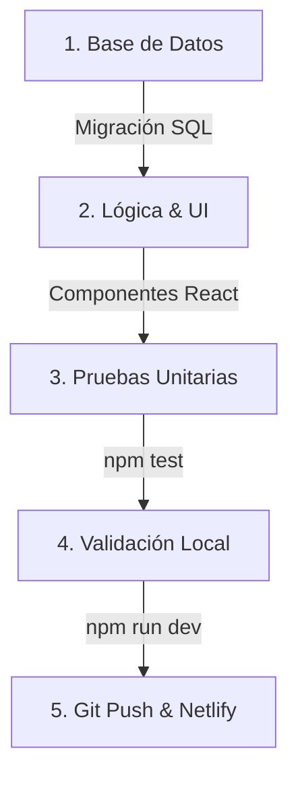

# 🚀 Guía de Desarrollo & Vibe Coding - Vexo

Esta guía establece el **Working Process** (proceso de trabajo) y las **Reglas de Programación** para la tienda virtual. Está diseñada para facilitar el *vibe coding* (programación asistida por IA) garantizando que el código permanezca limpio, seguro, testeable y libre de errores.

---

## 🔄 1. El Proceso de Trabajo (Working Process)

Cuando decidas implementar un nuevo feature (por ejemplo: "agregar cupones de descuento"), sigue siempre estos 5 pasos estructurados:



### Paso 1: Cambios en Base de Datos (Supabase)
Si el feature requiere guardar nueva información (ej. código de descuento, porcentaje):
- Diseña la tabla o columna en PostgreSQL.
- Escribe la migración o alteración SQL en tu editor de Supabase.
- Configura las políticas de seguridad RLS en Supabase para esa nueva tabla.

### Paso 2: Implementación en React
- Crea o edita los componentes en `src/components/` o `src/pages/`.
- Conéctalos a Supabase usando el cliente unificado `src/utils/supabaseClient.ts`.
- Usa los estilos globales del sistema de diseño definidos en `src/index.css`.

### Paso 3: Pruebas Unitarias (Tests)
- Crea o edita el archivo de pruebas correspondiente (ej. `cupones.test.ts`).
- Ejecuta `npm test` en tu terminal para garantizar que la nueva lógica funcione y que **no hayas roto ninguna funcionalidad previa**.

### Paso 4: Validación Visual Local
- Corre `npm run dev` y prueba el flujo manualmente en el navegador simulando dispositivos móviles.

### Paso 5: Despliegue en Producción
- Haz un commit y envíalo a tu repositorio privado de GitHub (`git push`).
- Netlify compilará el código y lo publicará en vivo automáticamente.

---

## 📜 2. Reglas Claras de Programación (Coding Standards)

Para mantener la calidad y consistencia del proyecto, tú y tus agentes de IA deben cumplir estrictamente estas reglas:

### Regla 1: Soporte Multi-moneda
* **PROHIBIDO**: Escribir símbolos de moneda estáticos como `"Bs."` o `"$"` directamente en el texto del HTML.
* **PERMITIDO**: Usar siempre la función `formatPrice` importada de `src/utils/currency.ts`.
  ```typescript
  import { formatPrice } from '../utils/currency';
  // CORRECTO:
  <span>{formatPrice(producto.precio)}</span>
  ```

### Regla 2: Consistencia en el Diseño (CSS)
* **PROHIBIDO**: Escribir colores genéricos en línea (`style={{ color: 'red' }}`) o inventar clases ad-hoc.
* **PERMITIDO**: Usar siempre los tokens del sistema de diseño definidos en `src/index.css` a través de variables CSS:
  ```css
  /* Ejemplo en index.css o estilos inline controlados */
  color: var(--text-success);
  background-color: var(--bg-card);
  border: 1px solid var(--border-color);
  ```

### Regla 3: Tipado Estricto con TypeScript
* **PROHIBIDO**: Abusar del tipo `any` en los datos.
* **PERMITIDO**: Definir interfaces o usar los tipos autogenerados para representar productos, clientes y pedidos.
  ```typescript
  export interface Product {
    id: string;
    sku: string;
    nombre: string;
    precio: number;
    activo: boolean;
    stock: number;
  }
  ```

### Regla 4: Cobertura de Tests
* Cualquier utilidad matemática, helper de fecha, formateador o lógica compleja de estado (como el carrito) **debe contar con su respectivo archivo `.test.ts` o `.test.tsx`** para ejecutarse con Vitest.

### Regla 5: Diseño Compacto Mobile-First
* **PROHIBIDO**: Escribir textos largos en títulos, labels, subtítulos o mensajes de placeholder. Toda la UI debe caber en una pantalla de teléfono sin scroll innecesario.
* **PERMITIDO**: Usar textos cortos y directos (ej. "Catálogo" en vez de "Nuestro Catálogo de Productos").
* Los paddings, márgenes y gaps deben ser los mínimos necesarios para mantener legibilidad.
* Evitar subtítulos descriptivos debajo de los títulos de página. Si se necesita contexto, usar placeholders en los inputs.
* Priorizar que el contenido principal (productos, formularios, tablas) sea visible sin hacer scroll en pantallas móviles.

---

## 🤖 3. Instrucciones para Vibe Coding con IA

Cuando trabajes con un asistente de codificación de IA (como Antigravity), puedes copiar y pegar este bloque al iniciar la conversación para alinearlo de inmediato:

> *"Hola. Estamos trabajando en el proyecto Vexo (Tienda Virtual). Antes de empezar a programar, lee nuestro archivo DEVELOPMENT_GUIDE.md.
>
> Reglas críticas que debes seguir:
> 1. Toda modificación de base de datos debe ir documentada con su script SQL.
> 2. Mantén el principio multi-moneda usando `formatPrice` de `src/utils/currency.ts`.
> 3. No uses estilos ad-hoc; adhiérete a las variables CSS de `src/index.css`.
> 4. Escribe o actualiza las pruebas unitarias usando Vitest y haz un `npm test` antes de dar por terminada la tarea para verificar regresiones.
> 5. Al crear componentes o vistas, prioriza la estética premium oscura y la responsividad móvil/PWA."*

---

## 📡 4. Opcional: Implementación Futura de "Lives" (Transmisiones en Vivo)

Por decisión estratégica, **la función de "Lives" se ha mantenido desactivada en el código activo de este MVP** para simplificar la interfaz de la Tienda Virtual. Sin embargo, la arquitectura ya está preparada a nivel de base de datos para que puedas decidir si implementarla en el futuro sin romper nada.

### Estructura ya preparada en Base de Datos:
* **Tabla `lives`**: Ya existe en [schema.sql](supabase/schema.sql) para registrar ID, nombre del directo, fecha y si está activo.
* **Columna `pedidos.live_id`**: Es una relación de clave foránea `Nullable` (acepta valores nulos). Los pedidos actuales se guardan con esta columna vacía sin generar ningún error.

### Pasos para implementarlo en el futuro (si decides activarlo):
Si deseas reactivar los directos, tú o tu asistente de IA deben realizar estos tres pasos:
1. **Administración de Directos**:
   - Crear una pestaña "Directos" en el panel de administración para listar, crear directos y marcar uno solo como `"activo"` (mediante un switch que apague los demás y encienda el seleccionado).
2. **Asociación en Checkout**:
   - Modificar la función de guardado en `pages/Checkout.tsx` para que, antes de registrar el pedido, haga una consulta rápida a Supabase: `SELECT id FROM lives WHERE activo = true LIMIT 1`.
   - Si existe un live activo, guardar ese ID en la columna `live_id` del nuevo pedido.
3. **Filtros en Dashboard**:
   - Añadir un menú desplegable en el panel de control de socios para filtrar las estadísticas y la tabla de pedidos por "Live" específico, facilitando el arqueo de caja al final de cada directo.

